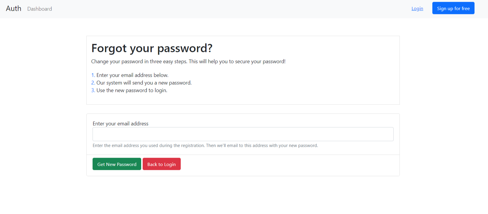

# general-authentication
A boilerplate for User authentication in a web application

### Youtube Link
<a href="https://youtu.be/W-SQj1Y_xbw">https://youtu.be/W-SQj1Y_xbw</a>

### Features-
- Implementation of the following for a user with respective html pages:
- Sign up with email

- Sign in (you can redirect to a blank home page with a sign out and reset password button
after sign in)

- Sign out
- Reset password after sign in

- The password stored in the db is encrypted
- Google login/signup (Social authentication)
- Forgot password (Generate a random password and send on
email)

### Display error messages for the following-
- Display notifications for unmatching passwords during sign up
- Incorrect password during sign in

### Add-ons
- Used parallel jobs for mailing reset password to users.
- Used Redis-cloud for connecting mailer queue
